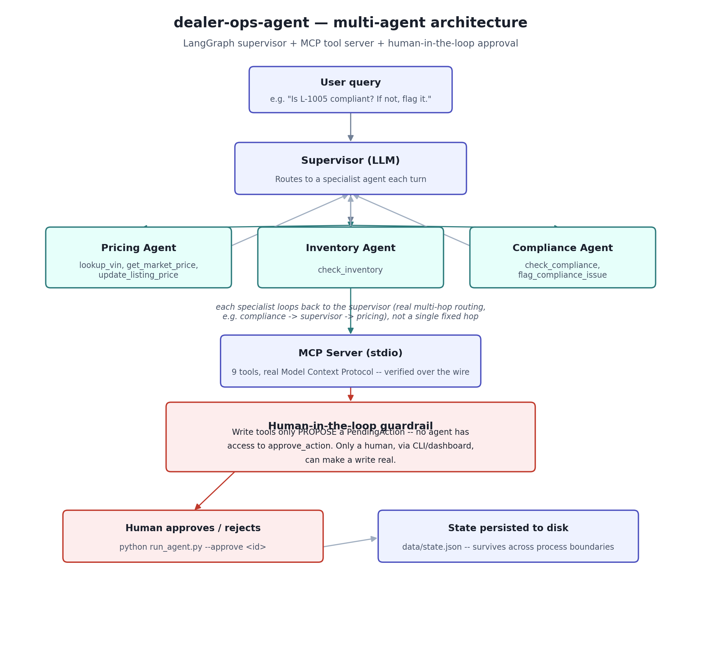

# 🚗 dealer-ops-agent — Multi-Agent Dealership Operations System

A multi-agent system built on **LangGraph** and a real **Model Context
Protocol (MCP)** server: a supervisor routes dealership operations requests
(pricing, inventory, compliance) to specialist agents, each bound to its own
subset of tools — with a structural human-in-the-loop guardrail on every
write action.

[](tests/)
[](LICENSE)
[](requirements.txt)

---

## 🏗️ Architecture



---

## 🔑 The core design decision: guardrails by construction, not by prompt

Every "agent framework" tutorial says to add human-in-the-loop for risky
actions. Most implement it as a prompt instruction ("ask for confirmation
before doing X") — which an LLM can ignore, get confused about, or route
around.

This project does it structurally instead:

- **`update_listing_price`** and **`flag_compliance_issue`** don't mutate
  anything. They create a `PendingAction` record and return it — the
  listing's price is unchanged, its status is unchanged.
- **`approve_action`** is the *only* function that mutates state, and it is
  **not given to any agent** — it's not in any specialist's tool list (see
  `AGENT_TOOL_ALLOWLIST` in `agents/graph.py`). It's only reachable via the
  CLI (`python run_agent.py --approve <id>`) or a human operator.
- This means it is **structurally impossible** for the agent graph to
  self-approve a write, regardless of what the LLM decides to do — not
  because a prompt tells it not to, but because the capability isn't wired
  to it at all.

This is verified in `tests/test_tools.py`
(`test_update_listing_price_does_not_mutate_immediately`, etc.) and proven
end-to-end via a real subprocess-boundary test in
`tests/test_persistence.py`.

---

## 🔌 Why a real MCP server (not a mocked one)

`mcp_server/server.py` is a genuine MCP server using the official Python
SDK (`FastMCP`) — not tool functions dressed up to look like MCP. This was
verified over the actual wire protocol, not just by importing Python
functions directly: `mcp_smoke_test.py` spawns the server as a real
subprocess, connects a real `ClientSession` over stdio, and calls tools
through the protocol, confirming structured JSON responses and correct
error propagation (`isError: True` with the right message on a bad VIN).

Run it yourself:
```bash
python mcp_smoke_test.py
```

Because it's a standard MCP server, it's also usable from any other
MCP-compatible client (Claude Desktop, an MCP inspector, etc.) — not just
this project's own LangGraph agents.

---

## 🤝 Multi-agent, not single-agent-with-tools

The supervisor doesn't just pick one specialist and stop — after a
specialist agent responds, control returns to the supervisor, which can
route to a *different* specialist if the request needs it (e.g. "check if
L-1005 is compliant, and if the price looks off, reprice it" could route
`compliance -> supervisor -> pricing`). This is what makes it a genuine
multi-agent graph rather than a single agent with a large toolset — see the
loop-back edges in the diagram above.

---

## 🗂️ Project Structure

```
dealer-ops-agent/
│
├── mcp_server/
│   ├── tools.py         # pure-function tool logic + state persistence (no MCP/LLM dependency)
│   └── server.py        # FastMCP server wrapping tools.py
│
├── agents/
│   └── graph.py          # LangGraph supervisor + 3 specialist agents
│
├── data/
│   ├── dealership_data.py   # simulated vehicles, listings, market comps
│   └── state.json            # persisted runtime state (listings + pending actions)
│
├── tests/
│   ├── test_tools.py          # 22 tests on the pure tool functions
│   └── test_persistence.py    # proves state survives across separate OS processes
│
├── utils/
│   └── cost_tracker.py   # LangChain callback: catches every LLM call in a graph run
│
├── assets/
│   └── architecture_diagram.png
│
├── run_agent.py           # CLI: run a query, list/approve/reject pending actions
├── mcp_smoke_test.py       # real MCP protocol round-trip test (not pytest -- run directly)
├── requirements.txt
├── requirements-dev.txt
├── LICENSE
└── README.md
```

---

## 🚀 Getting Started

```bash
pip install -r requirements.txt
export OPENAI_API_KEY=your_key_here

# Ask the agent system something
python run_agent.py "Is listing L-1005 compliant? If not, flag it."

# See what's awaiting human approval
python run_agent.py --list-pending

# Approve or reject
python run_agent.py --approve <action_id>
python run_agent.py --reject <action_id>
```

Try a multi-hop request to see the supervisor route through more than one
specialist:
```bash
python run_agent.py "Look up the market price for the F-150 in listing L-1001, and if it's underpriced by more than $2000, propose a new price."
```

---

## 🧪 Testing

24/24 tests pass, and **21 of them need no API key or LLM at all** — the
tool logic (`mcp_server/tools.py`) is pure Python with simulated data, so
it's fully unit-tested offline. Only the LangGraph orchestration layer
itself (`agents/graph.py`) needs a real OpenAI key, since that's where the
actual LLM calls happen.

```bash
pip install -r requirements-dev.txt
pytest tests/ -v
```

Coverage includes: every tool's happy path and error path, the
propose-vs-execute guardrail (write tools proven not to mutate state
immediately), the full approve/reject lifecycle, and — the test that
actually matters most here — **state surviving across genuinely separate
OS processes** (`test_pending_action_survives_across_separate_processes`),
which is the exact failure mode this project would otherwise have hit
silently: a price change proposed in one CLI invocation vanishing before a
later `--approve` call could see it.

---

## 💵 Cost tracking

`utils/cost_tracker.py` is a LangChain callback handler, not a manual
wrapper around individual `llm.invoke()` calls. That distinction matters
here specifically because this is a *multi-agent* system: the supervisor
makes its own LLM call, but so does every internal ReAct step inside each
specialist agent (via `create_react_agent`), and those are otherwise opaque
internals with no natural place to insert manual tracking. A callback
attached at `graph.invoke()` catches every LLM call anywhere in that
invocation automatically, wherever in the graph it happens.

---

## 🛠️ Tech Stack

| Component | Technology |
|---|---|
| Language | Python 3.10+ |
| Agent orchestration | LangGraph (supervisor pattern) |
| Tool protocol | MCP (Model Context Protocol), official Python SDK |
| LLM | gpt-4o-mini (default, configurable) |
| Testing | pytest |

---

## 📌 Future Improvements

- [ ] Streamlit dashboard for visually reviewing/approving pending actions (currently CLI-only)
- [ ] Swap the in-process stdio MCP connection for a persistent server over SSE/streamable-HTTP, so the server doesn't spin up fresh per CLI invocation
- [ ] Replace `data/state.json` with a real database once this needs to run concurrently
- [ ] Add a small eval set for supervisor routing accuracy (does "reprice this" reliably route to pricing?)
- [ ] Swap simulated dealership data for a real or realistic public dataset

---

## 📄 License

[MIT License](LICENSE)
